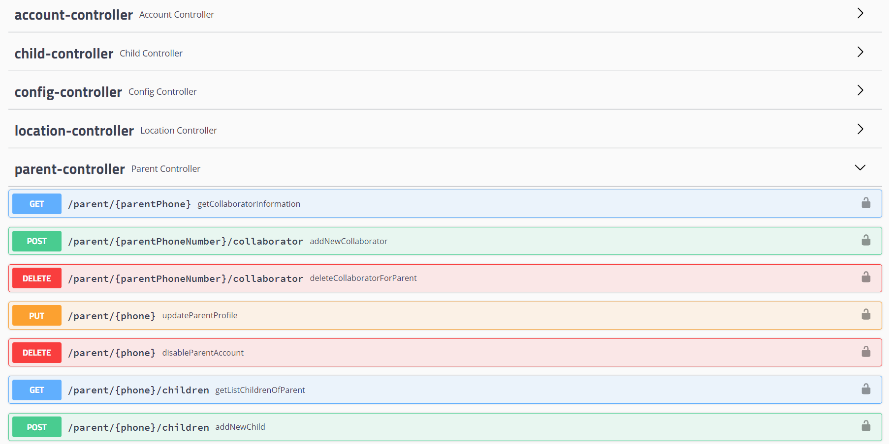
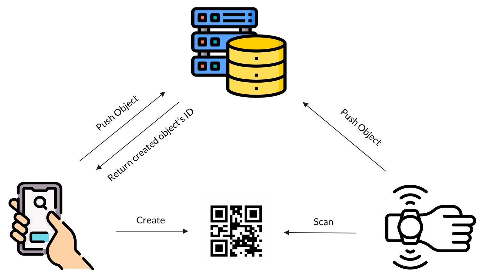
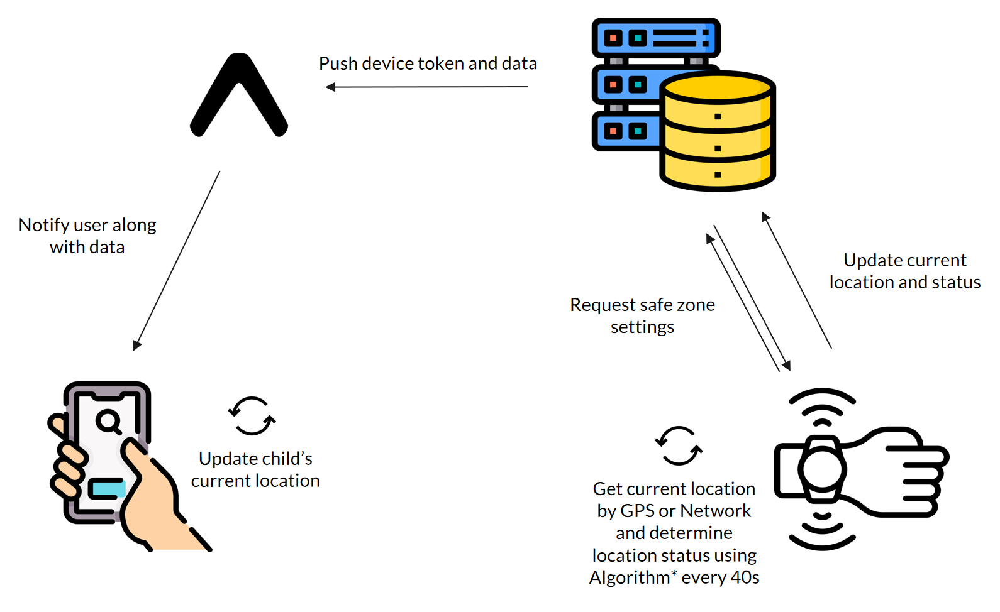
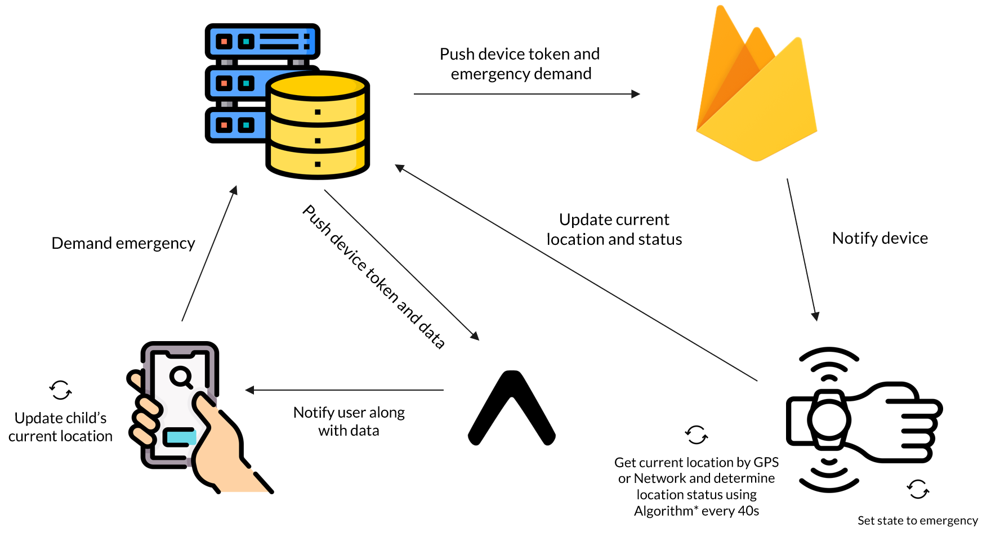
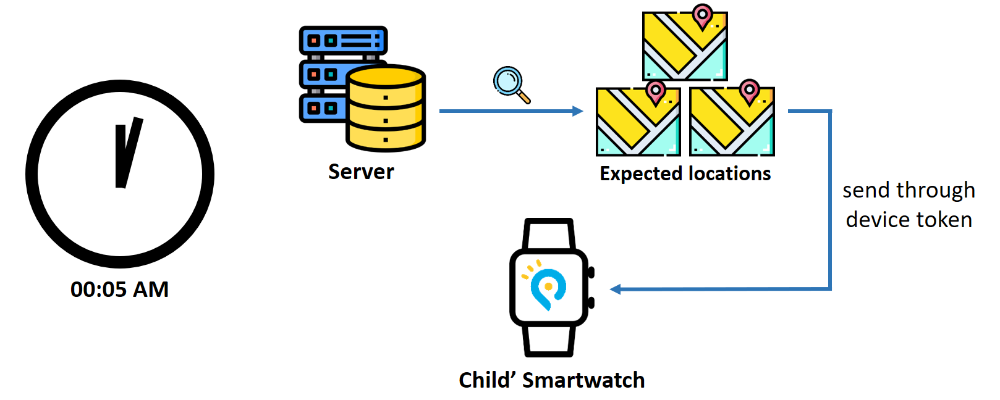

# [PETITE HERO](https://github.com/petite-hero) - FPT University Capstone Project
Children Management and Development Application

# Server
- Language: Java
- Framework: Spring Boot
- Developed on IntelliJ

# Contributors
- [Nguyễn Phú Hưng](https://github.com/hulk1999)
- [Võ Lam Trường](https://github.com/truongvlit)
- [Lâm Lệ Dương](https://github.com/llduong)
- [Âu Đức Tuấn](https://github.com/ibenrique2510)

# Functionalities
1. Authentication, OTP Verification, Password Encryption
2. CRUD for Accounts, Locations, Tasks, Achievements
3. Payment Handling with Paypal
4. Notification Handling with Firebase & Expo
5. Cron Jobs for Database Backup, Location & Task Updates 

# Installation Instructions
1. Install Apache Maven: https://maven.apache.org/download.cgi. Download binary zip archive (Windows), binary tar.gz archive (Linux)
2. Setting maven environment: https://www.tutorialspoint.com/maven/maven_environment_setup.htm
3. Go to project root, run "mvn spring-boot:run"
4. Check 127.0.0.1:8080/swagger-ui.html for API list

# System Flows
## 1. Connecting Mobile & Smartwatch Devices

## 2. Location Reporting
**Normal Flow**

**Live Update on Mobile**

## 3. Cron Job for Updating Location List

